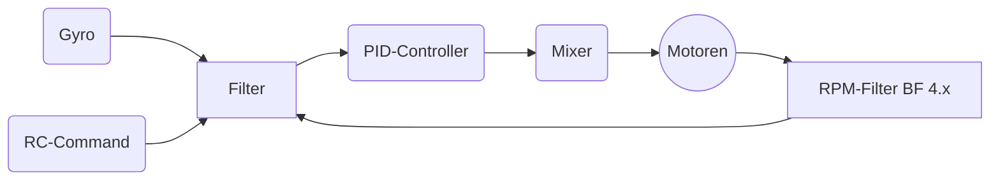

# **Betaflight / Deutsch**
## Historie
| Version  |  Datum |  Inhalt |
|:-:|---|---|
| 0.1  |  August 2020 | initial  |
| 0.2 | September 2020 | Material Theme, vereinzelte Updates, Mermaid2 Plugin |
| 0.3 | September 2020 | Mermaid Extension für Chrome, zusätzliche Installations-Informationen rund um MKDocs |
## Info
Dies hier ist eine Sammlung an Dokumenten die im Laufe meiner kurzen FPV-Fliegerei entstanden sind und auch weiter entstehen bzw weiter fortgeschrieben werden.

Hintergrund für diese Ansammlung der Dokumente ist, dass ich mehr Verständnis für mich selbst schaffen möchte und dadurch ein besseres Verständnis über die Zusammenhänge und dem Flugverhalten von FPV-Coptern zu erhalten.

Weiterhin möchte ich kein endloses Wiki in deutsch erstellen sondern einzelne Themenbereiche herauslösen - auch wenn es dadurch Redundanzen gibt. Für mich hat es den Vorteil, dass ich bestimmte Dokumente ausdrucken kann und mit zum Fliegen nehmen kann, wenn ich einen Copter optimieren möchte.

Tja und zum Schluß - ich kann mir einfach nicht alles im Kopf behalten, daher lese ich gerne nach und dann helfen mir kleinere Dokumente mehr als große.

Die einzelnen Seiten stehen auch zum Download als PDF zur Verfügung.

Leider habe ich keine Extension für Markdown gefunden, mit der man einfach ein Wort-Index aufbauen kann aber es gibt eine gute Alternative über [MKDocs]() und dem Theme welches ich nutzte.

Hier kann man über die Suchfunktion Wörter im Gesamten repository suchen -** sehr sehr hilfreich** -

**TIP**

	Installiert Euch lokal MKDocs und cloned dieses Repository und startet dann die Dokumente über `mkdocs serve`. 
	
	Aufruf über Euren Browser über `http:127.0.0.1:8000`

Vielleicht hilft es dem ein oder Anderen

Du kannst alle Seiten als PDF downloaden über .....

Viel Spass und propwash freies Fliegen

LunaX - August 2020


## Handhabung dieses Github-Repositories
Dies Repository basiert auf [MKDocs](https://mkdocs.org). Alle geschriebenen Seiten wurden als einfache Markdown-Dateien erstellt.


```
	mkdocs.yml (Konfigurationsdatei für MKDocs)
	docs/
		xxxx.md Dateien (einzelne Markdown-Dateien zu den Themen)
		css/ CSS Dateien
		js/ Javascript Dateien
		images/ Bilder die verwendet wurden
		
	sites/
		pdf/combined.pdf (hier liegt die Gesamt-PDF-Datei)
		<folder> (diverse Subfolder, enthalten HTML-Seiten und PDF (Einzeldateien) zum Offline-Lesen)

```

# Online-Lesen in GitHub
Wer online lesen möchte sollte sich für Chrome folgende Extension [Mermaid](https://github.com/Redisrupt/mermaid-diagrams) installieren, dann werden auch Diagramme generiert und nicht nur der Mermaid-Code wird angezeigt.

In einigen Dokumenten werden solche Diagramme genutzt (z.B. Filter)

Wenn alles sauber funktioniert solltet ihr hier ein Diagramm sehen



# Offline-Lesen
## via MKDocs
Du möchtest Dir gerne alles lokal auf Deine Rechner installieren, somit hast du immer Zugriff auf alle Daten selbst wenn Du den Rechner mit zum Fliegen nimmst und "mal eben" was nachschauen möchtest

!!! note "Tip"
	Mach Dir die Mühe und installiere [MKDocs](), dann hast du eine perfekte Übersicht und es funktioniert einwandfrei. MKDocs funktioniert auf MacOS, Linux und Windows (leider nicht auf iOS)
	

Installation 


## via static HTML-Sites
Clone dieses Repository und kopiere es irgendwo auf Deinen Rechner.

Im Verzeichnis `site`und in den Unterverzeichnissen sind alle `HTML`und `PDF`Seiten vorhanden.

Die Navigation ist allerdings nicht so möglich wie unter MKDocs.


