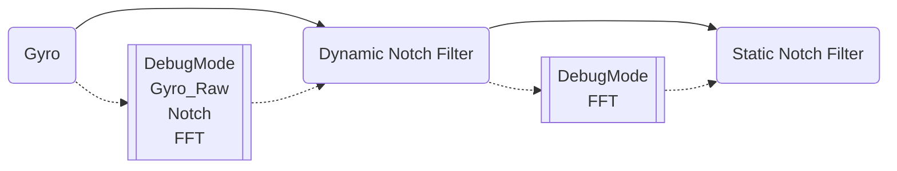
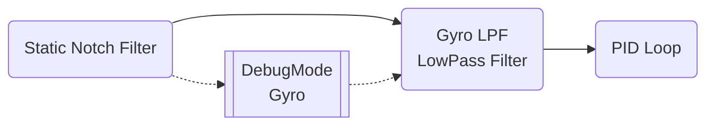
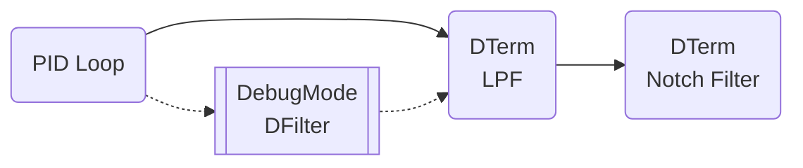
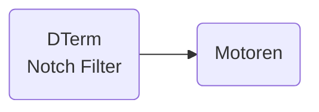

# _FILTER Ein * Eins_
## Inhaltsverzeichnis

[TOC]

{{TOC}}

## Historie
| Version  |  Datum |  Inhalt |
|:-:|---|---|
| 0.1  |  August 2020 | initial  |

# Allgemeines
## Typische Frequenzen
Vibrationen die am Copter auftreten lassen sich in verschiede Frequenzbereiche unterteilen

* 0 ~ 20Hz: normaler Frequenzbereich während des Fliegens (keine Filterung der Signale)
* 20 ~ 80Hz: Vibrationen niedriger Frequenz (häufig Propwash)
* 80 ~ 1000Hz: hochfrequente Vibrationen (Noise) verursacht durch
	- Motorvibrationen & Prop-Resonanzen. Hier sieht man auch das typische Bild des Motor-Vibrations-Bandes [Harmonics](#harmonics)
	- Frame-Resonanzen
	- ...

## _Noise / Vibrationen_
Ist eine Bezeichnung für Rauschen bzw. Gyro-Signale die nicht zu den gewünschten/benötigten Signalen sind, die durch den FC verarbeitet werden müssen. Also Messwerte die irreguläre sind und die Performance des Copters negativ beeinflussen. 
Noise (Rauschen) kann ausgelöst werden durch: 
* äußere Einflüsse (z.B. Wind, Kontakte mit Ästen, ...) 
* Vibrationen am Chassis (z.B. lose schrauben, dünne schwingende Arme, ...) 
* Vibrationen durch Motoren(z.B. Lagerschäden, Unwucht, ...) 
* Vibrationen durch Props (z.B. Unwucht, Prop-Wash, ...) 
* Kombinationen aus allem •.

Noise wird durch den Gyro und anschließend durch den PID- Controller verarbeitet und kann zu Fehlerhaften Verhalten führen. 

Eingesetzte Filter (LPF, NOTCH, ...) versuchen dieses Rauschen zu eliminieren. 

Eine Deiner Hauptaufgabe beim Tunen Deines Copters ist, dass du diese Vibrationen in den Griff bekommst ohne deutliche Delay zu bekommen.

**Hinweis:** 

Der DTerm-Anteil des PID-Controllers verstärkt Vibrationen deutlich. Daher ist eine Abstimmung der Filter mit dem DTerm gut abzustimmen.

Um Vibrationen zu analysieren musst du eine Blackbox-Analyse durchführen oder Tools wie `Blackbox-Explorer`, `PIDToolbox`oder `Plasmatree` verwenden.

Um einen ersten Eindruck von Vibrationen zu erhalten empfehle ich eine [Spektral-Analyse](https://github.com/mrRobot62/PIDtoolbox/wiki/SpectralAnalyzer).  Hier sieht man sehr deutlich in welchem Frequenzband Vibrationen an Deinem Copter auftreten.

Filter helfen, diese Vibrationen möglichst aus den Signalen für den Flight-Controller herauszufiltern um anschließend den Motoren möglichst saubere Signale zu übermitteln.

**Tip**
> Bevor du damit startetest die PID-Werte anzupassen, stelle Deine Filter optimal auf Deinen Copter ein. Erst dann fängst du mit den PID-Werten an.

Versuche durch Deine Filter ein maximales Gyro & DTerm Delay von <5ms zu erreichen. Du kannst das sehr einfach mit `PIDToolbox` erkennen.

## _Harmonics_
Harmonics oder Harmonische sind wiederkehrende Amplituden (Vibrationen) in den gleichen Frequenzabständen.

Das nachfolgende Bild zeigt deutlich drei sich im gleichen Abstand wiederholende Frequenz-Peaks von Vibrationen (Motor Vibrationen)

Beginnend mit dem Motor-Noise-Peak bei 158hz, dann die erste Harmonische Amplitude bei 316hz (2x158hz) und die dritte Amplitude bei 474hz (3x158).

Gyro-Data-Filtering
=========================================================
Signal & Prozessfluß zur Filterung

Grundlage Filter-Arten
=========================================================
## _Lowpass-Filter_
Niedrige Frequenzen werden durch den Filter durchgelassen, hohe Frequenzen werden gedämpft.

Hohe Frequenzen sind in der Regel im System nur Rauschen bzw. Vibrationen und werden für die Flugdaten nicht benötigt, daher versucht man sie herauszufiltern.

Mit dem LOWPASS-Filter wird eine Grenzfrequenz (`cut-off`) angelegt und der FC reduziert die Signale die oberhalb dieser Grenzfrequenz liegen. 

Die Dämpfungskurve ist eine Steigung. d.h. je höher die Signalfrequenz desto stärker die Dämpfung 

![Low Pass Filter][imgLPF]

Für den Einsatzbereich des Quadcopters ist der Frequenzbereich von 0-80Hz relevant, alles darüber sollte möglichst effizient weg gefiltert werden. 

**Beachten**
> Ein fundamentaler Aspekt ist, je niedriger der Schwellwert(Cutoff) für den Lowpass Filter ist - umso mehr muss gefiltert werden.

> Das wirkt sich auf dem Gesamtperformance aus. Daher gibt es mehrere andere Filter die andere Algorithmen verwenden und das System effizienter gestalten. 

## _Notch-Filter_
Notch-Filter[^NF] eigenen sich hervorragend zur Unterdrückung von Rauschen in einem sehr spezifischen Frequenzband.

Notch-Filter sind in der Regel effektiver zur Reduzierung von Motorrauschen als LPF- Filter aber ggf. müssen manuelle Abstimmungen durchgeführt werden um die Bandbreite und die Mittenfrequenz zu bestimmen (Notch=Kerbe) 

Weiterhin können Notch-Filter zur Reduzierung von Propwash genutzt werden.

![NotchFilter][imgDNF]

Der `Q-Faktor`(Quality-Factor) gibt die Güte des Notch-Filters an und beschreibt die Weite des Filters. Je größer der Q-Faktor, desto schmaler der Notch-Filter.

**Beispiel:**

Es wird festgestellt das wir ein Vibrationsspitze bei ca 260Hz haben (z.B. hervorgerufen durch Propwash), dann kann der Notch-Filter Cut-off bei ca. 200Hz beginnen und bei 300Hz enden

## _Static-Filter_
Im Rahmen von Betaflight werden statische Filter als LowPass-Filter oder als Notch-Filter genutzt

## _Dynamic-Filter_
Dynamic Filter reduzieren ebenfalls Rauschen, wenn die entsprechenden Parameter richtig eingestellt sind. Schwingungen, Motorgeräusche, ... können durch die Dynamic-Filter reduziert werden. 

Ein Dynamic-Filter ist ein Algorithmus, der die Frequenz des Rauschens erkennen kann und er kann den Notch-Filter verwenden, um ihn automatisch zu reduzieren. 

**Nachteil** von Dynamic-Filters ist die Erhöhung der CPU-Last und die Delays. 

Betaflight-Filter
=========================================================
## _RPM-Filter_
RPM-Filter [^RPM] sind eine besondere Filtertechnik in Betaflight. RPM-Filter basieren auf mehreren [Notch-Filter](#bf-dynamic-notchfilter) die präzise darauf ausgerichtet sind Motorvibrationen und ihre `Harmonics` zu filtern und möglichst komplett zu elimenieren. Für jeden Motore können bis zu drei Notch-Filter (max 3 Harmonics) generiert werden (Pro Achse). Das heißt insgesamt steht eine Bank von 36 Notch-Filtern zur Verfügung. 3 Achsen * 3 `Harmonics` * 4 Motoren = 36 Notch-Filter.

Die RPM-Filter basieren auf die Drehzahl der Motoren und dem bidrektionalen DShot-Protokoll in Zusammenspiel mit den Gyrodaten - daher auch `Gyro-RPM-Filter`

**BEACHTEN**
> RPM-Filter benötigen für BLHeli32 ESC die aktuellste Firmware `>= 32.7`

> Für BLHeli_S ESCs empfehle ich die FW von (auch wenn sie Geld kosten) [JFlight][JFLIGHT]

## _BF - Dynamic-Lowpassfilter_

## _BF - Static Notchfilter_ {#SNF}
Statische Notchfilter werden explizit mit der Center-Frequenz auf auf die Herzzahl der höchsten Vibrationen (Peak) gesetzt.
In BF kann man zwei dieser Notch-Filter aktivieren. Angegeben werden jeweils die Cutoff-Frequenz und die Center-Frequenz

## _BF - Dynamic-Notchfilter_
Ab `BF 3.1` kann man auch `Dynamic Notch Filter` einsetzen. Dieser hocheffiziente Dynamasiche Notch-Filter setzt sich automatisch auf den Motor-Peak - also den aktuelle höchste Frequenz der Motor-Vibrationen, basieren auf die jeweils aktuelle FFT-Analyse. Hierdurch wirkt dieser Notch-Filter in allen Throttle-Stellungen und wandert demnach durch das Frequenzband.

Dynamische Notch-Filter haben eine geringere Latzenzzeit als LP-Filter. Notch-Filter sind sehr effektiv und bei einer guten Abstimmung kann man sogar auf LPF-Filter verzichten. Dadurch steigert sich die Gesamtperformance des Copters.

LP-Filter aber einfach abschalten sollte wirklich mit bedacht gemacht werden.

Der Dyn-Notch-Filter ist per default eingeschaltet.

Es gibt zwei Notch-Filter für den GYRO. Einer oder beide können bei Bedarf abgestellt werden. 

Default-Values sind auf 200Hz-400Hz. Diese Grenzfrequenzen arbeiten sehr gut und funktionieren bei den meisten Coptern. 

Für eine Feinabstimmung ist es notwendig eine Blackbox- Auswertung durchzuführen (oder Plasma-Tree) 

## _BF - Static-Lowpassfilter_
In Betaflight wird zwischen zwei Static-LPF Filtern unterschieden

* PT1
* BIQUAD

### PT1
Dieser Filter hat eine etwas sanftere Kurve und ist ein LPF-Filter 1. Ordnung und hat dadurch eine geringere Latzenzzeit. Der Nachteil dieses Filters, er filtert nicht so stark Vibrationen aus dem Signal (bedingt durch seine Kurvenausprägung)

### BIQUAD
Dieser Filter hat eine deutliche steilere Kurve und filtert besser als ein PT1. Er ist ein Filter 2. Ordnung. Dadurch ist die Latzenzzeit schlechter, das Filterergebniss besser.

## _BF - Gyro-RPM-Filter_
Ein mächtiges neues Feature, welches mit BF 4.0 eingeführt wurde und in den nachfolgenden Releasen weiter verbessert wurde.
Die RPM Filter wurden weiter oben schon beschrieben, nachfolgend eine Reihe von Detailinformationen.

## _BF - Gyro-LowPass Filter_

## _BF - DTerm LowPass Filter_
Der DTerm verstärkt alles - auch Vibrationssignale - somit können ungefilterte DTerm Werte die direkt zu den Motoren gesendet werden dazu führen, dass die Motoren heiß werden oder sogar überhitzen und zerstört werden.

Hier kommen jetzt die DTerm-Lowpass Filter -> Einstellung wie bei den Static-Lowpassfilter

Allgemeinen ist ein Biquad-Filter das sinnvolle Minimum an Filterung mit einer Frequenz um 100 Hz bis hinunter zu 80 Hz, wenn man heiße Motoren hat.

***
[imgLPF]: images/lowpass-filter.png "LowPass-Filter"
[imgDNF]: images/classic_notchfilter_qfactor.png "Notch-Filter"

[^RPM]: [BF-RPMFilter](https://github.com/betaflight/betaflight/wiki/Bidirectional-DSHOT-and-RPM-Filter)
[^JFLIGHT]: https://jflight.net/index.php
[^NF]: Notch-Filter = Kerb-Filter 
