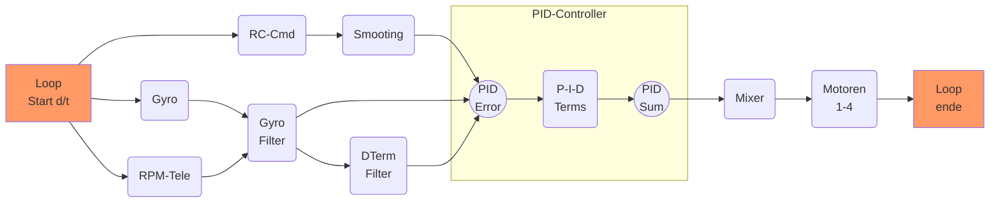

# PID - Controller
## Inhaltsverzeichnis
[TOC]

{{TOC}}

## Historie
| Version  |  Datum |  Inhalt |
|:-:|---|---|
| 0.1  |  August 2020 | initial  |

_Allgemeines_
---------------------
Berechnung des Fehlerwertes zwischen dem SOLL und IST-Wert
Der jeweilige Fehlerwert wird mit einer Konstanten (Kp, Ki, Kd)[^Kpid] multipliziert. Die Summe aller der Fehler ergibt den Gesamt Fehler PIDError


### Soll-Wert
In Falle von Coptern ist der Sollwert, der Wert der durch die Gimbals vorgegeben wird (RC-Command). Entspricht also dem Zielwert, den der Copter erreichen soll (z.B. der Copter soll ein Rolle mit 700deg/sec durchführen.


### IST-Wert
Ist der Wert, der durch das Gyro über alle drei Achsen gemessen wurde 

**Soll** & **IST** werden in der [PID-Loop](#pid-loop) kontinuierlich gelesen und ausgewertet. Signale werden geglättet und gefiltert. Das Endresultat entspricht für die aktuelle Zeiteinheit (d/t) den anliegenden PID-Error[^Perr]

* P [proportionaler Anteil](#p-term-proportionaler-fehler)
* I [integraler Anteil](#i-term-integraler-fehler)
* D [derivativer Anteil](#d-term-derivativer-wert-vorhersage)

![PIDController][imgPIDCtrl]


## _PID-Loop_ 
Die PID-Loop in Betaflight beinhaltet (für **alle** Achsen) folgende Punkte (vereinfachte Darstellung und nicht 100% vollständig). Die PID-Loop beschreibt auch die maximale [Looptime](#looptime-dt)


_P-Term (Proportionaler Fehler)_
---------------------

Der PTerm versucht den proportionalen Fehler möglichst schnell auf 0 zu reduzieren. 

Vereinfacht gesagt: Wie hart der FC daran arbeitet den Fehler zu korrigieren. Je höher der PTerm um so schärfer ist die Reaktion. Ein zu hoher PTerm führt aber zu Oszillation und Überschwingen.

Eingabewerte:

* SOLL ist der RC-Command Wert (Stick) 
* IST ist der GYRO Wert 

**Beispiel:**
```
	Kp = 0.2
	Input = 100
	GYRO = 60 	
	Perr = Kp * (60-100) => 8
	 
```

_I-Term (Integraler Fehler)_
---------------------
Ist eine Aufsummierung aller bis dato aufgetretenen Fehler über die Zeit (d/t). 

Mit dem ITerm wird eingestellt wie hart/schnell der FC reagieren soll gegen Umwelteinflüsse (z.B. Wind) um eine definierte Lage/Höhe beizubehalten. 

Somit wird ein stetiger Fehler, der anliegt und durch den P-Wert nicht korrigiert werden konnte, durch den I-Wert kompensiert, um den Gesamtfehler möglichst schnell auf 0 zu bringen. 

**ITerm:** Driftet der Copter ohne Steuerbefehl, dann den ITerm erhöhen. 

Musst man sehr häufig die Flugbahn korrigieren (besonderen bei höheren Throttle) dann ist der ITerm zu niedrig 

**Beispiel:**
> Wenn bei schnellen Throttle-Bewegungen der Copter nicht stabil bleibt, ist häufig der ITerm zu niedrig. 

`d/t = Zeiteinheit - im Beispiel gehen wir von 1 aus (einfacher zu rechnen)`

```
Im Beispiel gehen wir davon aus, dass IerrSum = -1 ist
	Ki = 0.02
	Input = 100
	Gyro = 80
	IerrSum = IerrSum + (80-100
	Ierr = Ki * IerrSum * d/t
	Ierr = 0,05 * -21 * d/t
	Ierr = -1,05
	
```

_D-Term Derivativer-Wert (Vorhersage)_
---------------------
Der DTerm ist im Prinzip der Gegenpart zum PTerm und versucht eine Vorhersage zu treffen, wie der Fehlerwert in der Zukunft ist und versucht diesem entgegen zu wirken. 

P & D hängen eng beieinander. 

Der DTerm ist ein Dämpfungsglied für ein Überkorrigieren des P-Reglers und versucht „Overshoots“ zu minimieren. Ähnlich einem Schock-Absorber. 

Den DTerm erhöhen kann eine Oszillation mehr glätten. Zu hohe DTerm führen aber zu heißen Motoren und können bis zur Zerstörung des ESCs oder des Motors führen. 

Extensive D-Werte führen auch zu einer Vermindung des Anspruchverhaltens des Copters. 

```
Im Beispiel gehen wir davon aus, dass DerrAlt = -4 ist
	Kd = 0.1
	Input = 100
	Gyro = 80
	DerrTmp = (80-100) - DerrAlt = -16
	Derr = Kd * (-16) * d/t
	Derr = -1.6
	
```

_Looptime (d/t)_ 
---------------------
Den Zyklus den der PID-Controller benötigt das Eingangssignal (Eingangswert) und der daraus resultierenden Kalkulation und einen Ausgabewert zu berechnen bezeichnet man als „Loop“. 

Die dazu benötigte Zeit wird „Looptime“ genannt Looptime wird in ms (Millisekunden) berechnet bzw. in Hz 

```
1sek = 1000ms = 1Hz = 1 Zyklus 
1ms = 0.001sek = 1KHz 

4k Looptime = 4000x die Loop durchlaufen pro Sekunde
```

Daher ist es auch wichtig, dass man in BF die Looptime so einstellt das der FC dies auch verarbeiten kann ohne Fehlberechnungen durchzuführen 

**Beispiel FC F405**
4KHz = 4000 Loops pro Sekunde - das schafft der FC problemlos 8KHz = 8000 Loops ist für einige F4 FCs zu viel, wenn zusätzliche Filter eingeschaltet wurden.
Bei F7 FCs ist 8K typisch.


---------------------

[^Kpid]: Fehlerkonstanten, werden pro Achse in BF eingestellt.
[^Perr]: PID-Error, Summe aller anliegenden Fehlersignale.
[^DT] : empty


[imgPIDCtrl]: images/pidController.png "PID Controller"