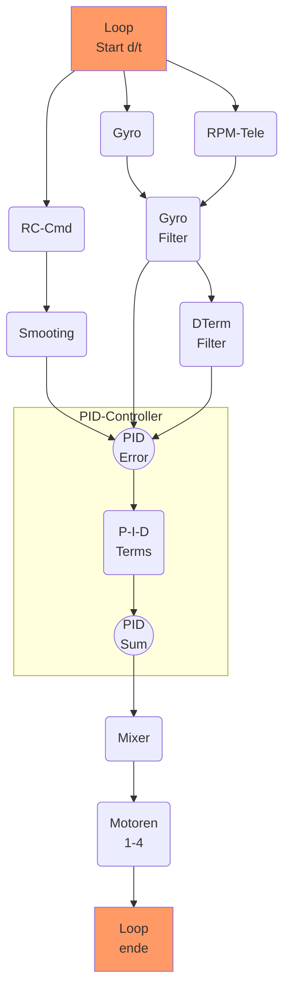

# PID - Controller


## Inhaltsverzeichnis
- [PID - Controller](#pid---controller)
	- [Inhaltsverzeichnis](#inhaltsverzeichnis)
	- [Historie](#historie)
	- [_Allgemeines_](#allgemeines)
		- [Soll-Wert](#soll-wert)
		- [IST-Wert](#ist-wert)
	- [_PID-Loop_](#pid-loop)
	- [PIDError & PIDSum](#piderror--pidsum)
		- [PID error](#pid-error)
		- [PID SUM](#pid-sum)
	- [_P-Term (Proportionaler Fehler)_](#p-term-proportionaler-fehler)
	- [_I-Term (Integraler Fehler)_](#i-term-integraler-fehler)
	- [_D-Term Derivativer-Wert (Vorhersage)_](#d-term-derivativer-wert-vorhersage)
	- [_Looptime (d/t)_](#looptime-dt)
- [PID tunen](#pid-tunen)

{{TOC}}

## Historie
| Version  |  Datum |  Inhalt |
|:-:|---|---|
| 0.1  |  August 2020 | initial  |
| 0.2  |  September 2020 | Update DTerm  |

_Allgemeines_
---------------------
Ein PID-Controller (PID-Regler) berechnet und reagiert auf den Fehlerwert der zwischen dem SOLL und dem IST-Wert. Jeweils für `P`, `I` und `D` wird dieser Fehler mit einer internen Konstanten (Kp, Ki, Kd)[^Kpid] multipliziert. Die Summe aller der Fehler ergibt den Gesamt Fehler frn PIDError

Übrigens, diese Konstanten sind die Werte die man in Betaflight pro Achse erfasst.

!!! note "Hinweis"

	`PTerm` & `DTerm` arbeiten gegeneinander. Erhöht sich der `P-Wert`verringert sich der `D-Term`. Verringert sich der `P-Wert`dann erhöht sich der `D-Wert`


### Soll-Wert
In Bezug auf Copter ist der Sollwert der Wert, der durch die Gimbals vorgegeben wird (RC-Command). Entspricht also dem Zielwert, den der Copter erreichen soll (z.B. der Copter soll ein Rolle mit 700deg/sec durchführen.


### IST-Wert
Der `IST-Wert` wird durch das verbaute Gyro über alle drei Achsen gemessen und repräsentiert den aktuellen Zustand des Copters.


**Soll** & **IST** werden in der [PID-Loop](#pid-loop) kontinuierlich gelesen und ausgewertet. Signale werden geglättet und gefiltert. Das Endresultat entspricht für die aktuelle Zeiteinheit (d/t) den anliegenden PID-Error[^Perr]

* P [proportionaler Anteil](#p-term-proportionaler-fehler)
* I [integraler Anteil](#i-term-integraler-fehler)
* D [derivativer Anteil](#d-term-derivativer-wert-vorhersage)

![PIDController][imgPIDCtrl]


## _PID-Loop_ 
Die PID-Loop in Betaflight beinhaltet (für **alle** Achsen) folgende Punkte (vereinfachte Darstellung und nicht 100% vollständig). Die PID-Loop beschreibt auch die maximale [Looptime](#looptime-dt)



--------------------------------
## PIDError & PIDSum
### PID error
Ist eine Aufsummierung aller anliegenden Fehler über all Achsen hinweg. Ein optimal (in der Theorie) getunter Copter liegt das Fehlersignal bei 0 und folgt somit exakt dem angegebenen Setpoint.

Die größten Fehler entstehen in schnellen Manövvern bei Rolls & Flips. Propwash zeigt sich ebenfalls im PIDError und treibt diesen nach oben.

$`PIDError = Setpoint - Gyro`$

### PID SUM
Ist die Summe aller Anpassungen durch den PID-Controller bevor sie an die Motoren übergeben werden.

--------------------------------
## _P-Term (Proportionaler Fehler)_

Der PTerm versucht den proportionalen Fehler möglichst schnell auf 0 zu reduzieren. 

Vereinfacht gesagt: Wie hart der FC daran arbeitet den Fehler zu korrigieren. Je höher der PTerm um so schärfer ist die Reaktion. 

**Ein zu hoher PTerm führt aber zu Oszillation und Überschwingen.**

Eingabewerte:

* SOLL ist der RC-Command Wert (Stick) 
* IST ist der GYRO Wert 

**Beispiel:**
```
	Kp = 0.2
	Input = 100
	GYRO = 60 	
	Perr = Kp * (60-100) => 8
	 
```

!!! note "P-Term in a Nutshell"

	* Der PTerm ist proportional zur Fehlergröße zwischen Setpoint und Gyro
	* Größere Fehler bedeuten stärker gegen den Setpoint anzuarbeiten
	* Kleinere Fehler bedeuten weiter zu machen aber in kleinen Schritten
	* Kein Fehler bedeutet, keine Differenz zwischen Setpoint und Gyro
	* Der PTerm ist die primäre Größe für das Fluggefühl und das Handling
	* Ein hoher PGain bedeutet, der Copter reagiert schneller um and die geforderte Ziel Rotation heranzukommen
	* Hoher PGain heißt schärferes verhalten und fühlt sich auch so an
	* zu hoher PGain führt unweigerlich zu mehr Oszillation und kann in Flugunfähigkeit enden.
	* Kleiner PGain fühlt sich softer an - vielleicht auch schwamming

_I-Term (Integraler Fehler)_
---------------------
Ist eine Aufsummierung aller bis dato aufgetretenen Fehler über die Zeit (d/t). 

Mit dem ITerm wird eingestellt wie hart/schnell der FC reagieren soll gegen Umwelteinflüsse (z.B. Wind) um eine definierte Lage/Höhe beizubehalten. 

Somit wird ein stetiger Fehler, der anliegt und durch den P-Wert nicht korrigiert werden konnte, durch den I-Wert kompensiert, um den Gesamtfehler möglichst schnell auf 0 zu bringen. 

**ITerm:** Driftet der Copter ohne Steuerbefehl, dann den ITerm erhöhen. 

Musst man sehr häufig die Flugbahn korrigieren (besonderen bei höheren Throttle) dann ist der ITerm zu niedrig 

**Beispiel:**
> Wenn bei schnellen Throttle-Bewegungen der Copter nicht stabil bleibt, ist häufig der ITerm zu niedrig. 

`d/t = Zeiteinheit - im Beispiel gehen wir von 1 aus (einfacher zu rechnen)`

```
Im Beispiel gehen wir davon aus, dass IerrSum = -1 ist
	Ki = 0.02
	Input = 100
	Gyro = 80
	IerrSum = IerrSum + (80-100
	Ierr = Ki * IerrSum * d/t
	Ierr = 0,05 * -21 * d/t
	Ierr = -1,05
	
```

!!! not "ITerm in a Nutshell"

	* Proportional zur Größe und zur Dauer des Fehlers
	* korrigiert aggregierten und un-korrigierten Fehler
	* korrigiert statische Fehler und anhaltende Beeinflussungen
	* Wenn zu niedrig wird der Copter slippen, wie ein Auto auf dem Eis
	* Erhöhe den ITerm solange bis der Copter auf allen Achsen seine Lage behält nach einem scharfen Throttle-Boost. Alle weiters regelt der `anti_gravity_gain` 
	* im BF dend ITerm nur so lange erhöhen, bis der Copter während des normalen Fluges die Fluglage hält, dann die `anti_gravity_gain` zur Steuerung der Gaskopplung hinzufügen

_D-Term Derivativer-Wert (Vorhersage)_
---------------------
Der DTerm ist im Prinzip der Gegenpart zum PTerm und versucht eine Vorhersage zu treffen, wie der Fehlerwert in der Zukunft ist und versucht diesem entgegen zu wirken. 

**Der DTerm verstärkt hohe Frequenzen des Gyro-Signals und kann somit zur Überhitzung und Zerstörung der Motoren führen. Der Verstärkungsfaktor kann zwischen 10x - 100x betragen.**


P & D hängen eng beieinander. 

Der DTerm ist ein Dämpfungsglied für ein Überkorrigieren des P-Reglers und versucht „Overshoots“ zu minimieren. Ähnlich einem Schock-Absorber, allerdings mit dem Merkmal, das hohe Frequenzen nicht gedämpft sondern verstärkt werden.
!!! note "Vergleich"

	Stelle dir die Federung Deines Autos vor. Die Felder ist der PTerm und der Stoßdämpfer ist der DTerm. 
	Ohne den Stoßdämpfer (oder ein kaputer Stossdämpfer) führt zu einem Aufschwingen Deines Autos. (Oszillation).
	Der Stoßdämpfer dämpft dieses Aufschwingen und ist daher der Gegenpart zur Feder
	(das ist eine vereinfachte Darstellung, die lediglich ein plastisches Beispiel zeigen soll. 
	Physikalisch stimmt das nicht mit unserem PID-Controller über ein.)

Den DTerm erhöhen kann eine Oszillation mehr glätten. Zu hohe DTerm-Werte führen aber zu heißen Motoren und können bis zur Zerstörung des ESCs oder des Motors führen. 

Extensive D-Werte führen auch zu einer Vermindung des Anspruchverhaltens des Copters. 

```
Im Beispiel gehen wir davon aus, dass DerrAlt = -4 ist
	Kd = 0.1
	Input = 100
	Gyro = 80
	DerrTmp = (80-100) - DerrAlt = -16
	Derr = Kd * (-16) * d/t
	Derr = -1.6
	
```

_Looptime (d/t)_ 
---------------------
Den Zyklus den der PID-Controller benötigt das Eingangssignal (Eingangswert) und der daraus resultierenden Kalkulation und einen Ausgabewert zu berechnen bezeichnet man als „Loop“. 

Die dazu benötigte Zeit wird „Looptime“ genannt Looptime wird in ms (Millisekunden) berechnet bzw. in Hz 

```
1sek = 1000ms = 1Hz = 1 Zyklus 
1ms = 0.001sek = 1KHz 

4k Looptime = 4000x die Loop durchlaufen pro Sekunde
```

Daher ist es auch wichtig, dass man in BF die Looptime so einstellt das der FC dies auch verarbeiten kann ohne Fehlberechnungen durchzuführen 

**Beispiel FC F405**
4KHz = 4000 Loops pro Sekunde - das schafft der FC problemlos 8KHz = 8000 Loops ist für einige F4 FCs zu viel, wenn zusätzliche Filter eingeschaltet wurden.
Bei F7 FCs ist 8K typisch.

--------------------------------------------
# PID tunen

Schaue dir das `bf_tuning.md` Dokument an


---------------------

[^Kpid]: Fehlerkonstanten, werden pro Achse in BF eingestellt.
[^Perr]: PID-Error, Summe aller anliegenden Fehlersignale.
[^DT] : empty


[imgPIDCtrl]: images/pidController.png "PID Controller"